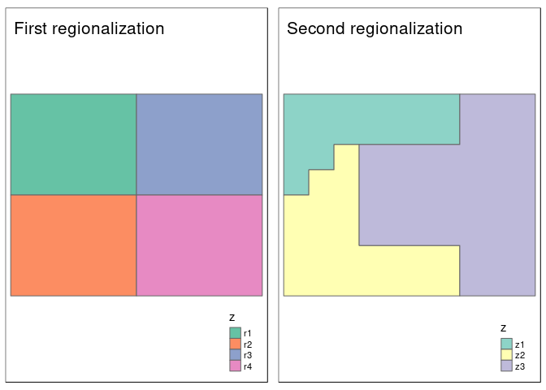
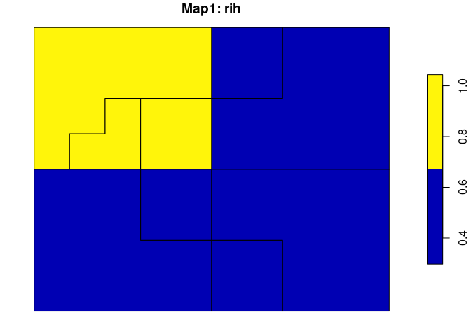
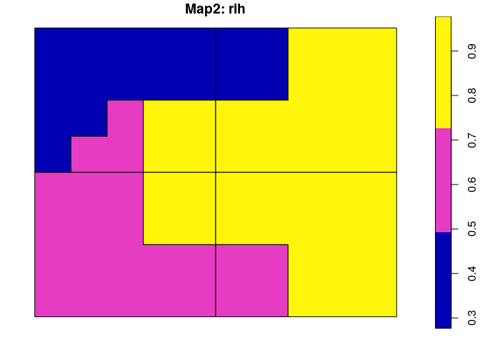

<!-- README.md is generated from README.Rmd. Please edit that file -->

# sabre

[](https://travis-ci.org/Nowosad/sabre)
[](https://codecov.io/github/Nowosad/sabre?branch=master)

The **sabre** (**S**patial **A**ssociation **B**etween
**RE**gionalizations) is an R package for calculating a degree of
spatial association between regionalizations or categorical maps. This
package offers support for `sf` spatial objects, and the following
methods:

  - the V-measure method (Nowosad and Stepinski, 2018)
  - the MapCurve method (Hargrove et al.,
2006)

## Installation

<!-- You can install the released version of `sabre` from [CRAN](https://CRAN.R-project.org) with: -->

<!-- ``` r -->

<!-- install.packages("sabre") -->

<!-- ``` -->

You can install the development version from
[GitHub](https://github.com/nowosad/sabre) with:

``` r
# install.packages("devtools")
devtools::install_github("Nowosad/sabre")
```

## Example

We use two simple regionalization, `regions1` and `regions2` to show the
basic concept of calculating a degree of spatial association.

``` r
library(sabre)
library(sf)
data("regions1")
data("regions2")
```

The first map, `regions1` consists of four regions of the same shape and
size, while the second one, `regions2` has three irregular
regions.



The `vmeasure_calc()` function allows for calculation of a degree of
spatial association between regionalizations or categorical maps using
the information-theoretical V-measure. It requires, at least, four
arguments:

  - `x` - an `sf` object containing the first regionalization
  - `x_name` - a name of the column with regions names of the first
    regionalization
  - `y` - an `sf` object containing the second regionalization
  - `y_name` - a name of the column with regions names of the second
    regionalization

<!-- end list -->

``` r
regions_vm = vmeasure_calc(regions1, z, regions2, z)
```

The result is a list with three metrics of spatial association -
`V-measure`, `Homogeneity`, `Completeness` - and two `sf` objects with
preprocessed input maps - `$map1` and `$map2`.

``` r
regions_vm
#> The SABRE results:
#> 
#>  V-measure: 0.36 
#>  Homogeneity: 0.32 
#>  Completeness: 0.42 
#> 
#>  The spatial objects could be retrived with:
#>  $map1 - the first map
#>  $map2 - the second map
```

Both spatial outputs have two columns. The first one contains regions’
names/values and the second one (`rih`) describes regions’
inhomogeneities.

``` r
plot(regions_vm$map1["rih"], main = "Map1: rih")
plot(regions_vm$map2["rih"], main = "Map2: rih")
```



See [the package
vignette](https://nowosad.github.io/sabre/articles/sabre.html) for more
examples.

## References

  - Nowosad, Jakub, and Tomasz Stepinski. “Spatial association between
    regionalizations using the information-theoretical V-measure”.
    <http://doi.org/10.17605/OSF.IO/RCJH7>
  - Rosenberg, Andrew, and Julia Hirschberg. “V-measure: A conditional
    entropy-based external cluster evaluation measure.” Proceedings of
    the 2007 joint conference on empirical methods in natural language
    processing and computational natural language learning
    (EMNLP-CoNLL). 2007.
  - Hargrove, William W., Forrest M. Hoffman, and Paul F. Hessburg.
    “Mapcurves: a quantitative method for comparing categorical maps.”
    Journal of Geographical Systems 8.2 (2006): 187.
