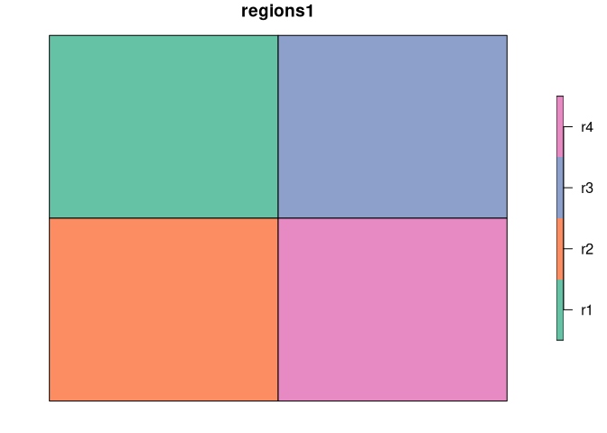

<!-- README.md is generated from README.Rmd. Please edit that file -->
sabre
=====

[](https://travis-ci.org/Nowosad/sabre) [](https://codecov.io/github/Nowosad/sabre?branch=master)

The **sabre** (**S**patial **A**ssociation **B**etween **RE**gionalizations) is an R package for calculating a degree of spatial association between regionalizations or categorical maps. This package offers support for `sf` spatial objects, and the following methods:

-   the V-measure method
-   the MapCurve method (Hargrove et al., 2006)

Installation
------------

<!-- You can install the released version of sabre from [CRAN](https://CRAN.R-project.org) with: -->
<!-- ``` r -->
<!-- install.packages("sabre") -->
<!-- ``` -->
You can install the development version from [GitHub](https://github.com/) with:

``` r
# install.packages("devtools")
devtools::install_github("Nowosad/sabre")
```

Examples
--------

``` r
library(sabre)
library(sf)
#> Linking to GEOS 3.6.1, GDAL 2.2.1, proj.4 4.9.3
data("regions1")
data("regions2")
```

``` r
library(tmap)
rm1 = tm_shape(regions1) + tm_polygons("z")
rm2 = tm_shape(regions2) + tm_polygons("z")
tmap_arrange(rm1, rm2)
#> Warning: Currect projection of shape regions1 unknown. Long-lat (WGS84) is
#> assumed.
#> Warning: Currect projection of shape regions2 unknown. Long-lat (WGS84) is
#> assumed.
#> Warning: Currect projection of shape regions1 unknown. Long-lat (WGS84) is
#> assumed.
#> Warning: Currect projection of shape regions2 unknown. Long-lat (WGS84) is
#> assumed.
```



``` r
regions_vm = sabre_calc(regions1, z, regions2, z)
regions_vm
#> # A tibble: 1 x 5
#>   map1         map2         v_measure homogeneity completeness
#>   <list>       <list>           <dbl>       <dbl>        <dbl>
#> 1 <sf [4 × 3]> <sf [3 × 3]>     0.361       0.315        0.423
```

``` r
data("eco_us")
```

``` r
em1 = tm_shape(eco_us) + tm_fill("PROVINCE", legend.show = FALSE)
em2 = tm_shape(eco_us) + tm_fill("SECTION", legend.show = FALSE)
tmap_arrange(em1, em2)
```


``` r
eco_us_vm = sabre_calc(eco_us, PROVINCE, eco_us, SECTION)
eco_us_vm
#> # A tibble: 1 x 5
#>   map1          map2           v_measure homogeneity completeness
#>   <list>        <list>             <dbl>       <dbl>        <dbl>
#> 1 <sf [35 × 3]> <sf [164 × 3]>     0.797       1.000        0.663
```

References
----------

-   Rosenberg, Andrew, and Julia Hirschberg. "V-measure: A conditional entropy-based external cluster evaluation measure." Proceedings of the 2007 joint conference on empirical methods in natural language processing and computational natural language learning (EMNLP-CoNLL). 2007.
-   Hargrove, William W., Forrest M. Hoffman, and Paul F. Hessburg. "Mapcurves: a quantitative method for comparing categorical maps." Journal of Geographical Systems 8.2 (2006): 187.
